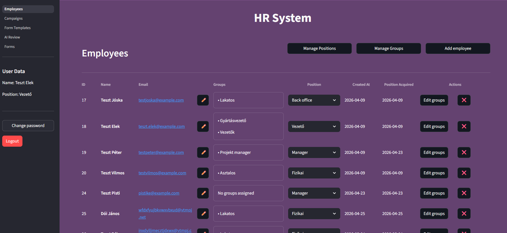
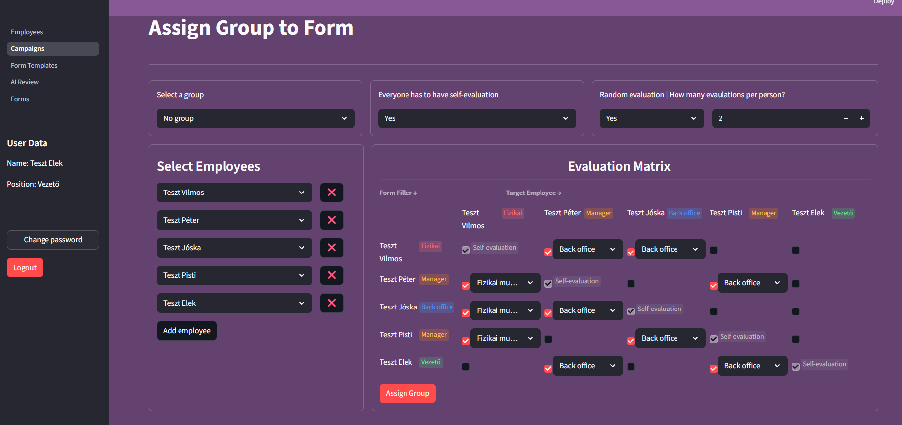
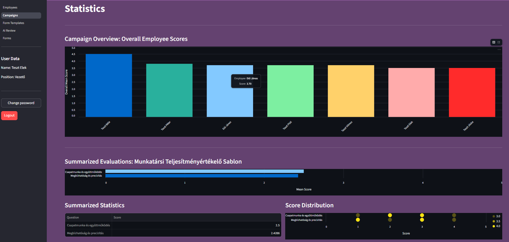
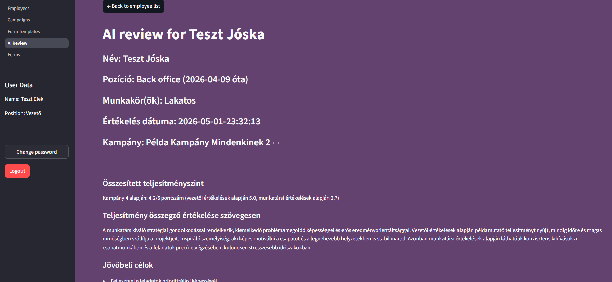

## Elvégzett munka témája és célkitűzései
A fejlesztés közvetlen kiváltó oka a vállalati környezetben alkalmazott komplex, csapatalapú és kölcsönös értékelési módszertanok modernizációja volt. Ezek a folyamatok hagyományosan hatalmas mennyiségű strukturált (számszerű pontszámok) és strukturálatlan (szabadszöveges válaszok) adatot eredményeznek, amelyek manuális feldolgozása a HR szakemberek számára rendkívül időigényes. 
A projekt elsődleges célja egy olyan önállóan működőképes, biztonságos webes alkalmazás megtervezése és implementálása volt, amely a generatív nyelvi modellek (LLM) segítségével automatizálja a visszajelzések szintetizálását. A tervezés során kritikus szempont volt, hogy a mesterséges intelligencia ne hozzon önálló döntéseket az alkalmazottakról, hanem magyarázható, transzparens és visszakövethető analitikával, valamint személyre szabott fejlődési javaslatokkal támogassa az emberi döntéshozatalt. 

## Az elért eredmények leírása
A félév során sikeresen elkészült a rendszer működőképes, platformfüggetlen prototípusa. A szoftver robusztus, háromrétegű moduláris architektúrára épül: 
-	Megjelenítési réteg: A Python-alapú Streamlit keretrendszerrel készült, amely közvetlen Python kódolással biztosít gyors, interaktív és adatvezérelt felhasználói felületet. 
-	Adatelérési réteg: Az adatok tartós tárolásáért egy helyi relációs SQLite adatbázis felel, amely szigorú idegenkulcs-kényszerítéssel védi az adatintegritást és automatikus séma-migrációra képes. 
-	Üzleti logika és MI integráció: Megvalósult a teljes körű, CRUD elveket követő szerepkör- és pozícióalapú jogosultságkezelés, valamint az automatizált e-mail alapú kampányértesítések rendszere. 
A kiértékelési fázisban az alkalmazás az OpenRouter interfészen keresztül elért OpenAI és LangChain ágensek segítségével végzi el az emberi visszajelzések feldolgozását. A transzparenciát és a promptok működésének megfigyelhetőségét a Phoenix/OpenTelemetry lokális tracing szerver integrációja biztosítja, amely háttérben naplózza a promptokat, a generálási időket és a tokenfogyasztást.

Néhány kép a rendszerről:

